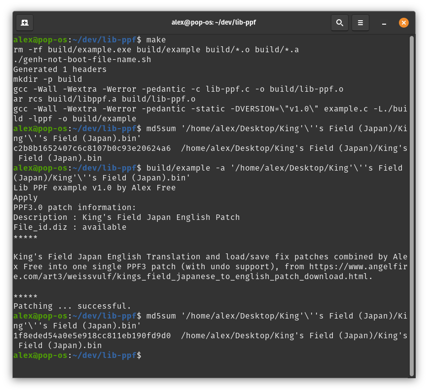

# Lib PPF - A PlayStation Patch File (PPF) Library

_by Alex Free_

This is a C library that can be used in your program to apply or undo ppf patches self-contained in the executable file itself  (in the form of unsigned char arrays, instead of an actual ppf patch file) to disc image files. These was made possible by modifying the original [Paradox PPF code](#icarusparadox) released many years ago under open terms.

For dealing with PlayStation 1/2 CD images, it is highly recommended to use this in combination with my [Lib PS-CD-ID](https://github.com/alex-free/lib-ps-cd-id) for disc image identification pre-patch.

An example has been included ([example.c](https://github.com/alex-free/lib-ppf/blob/master/example.c)) that uses this library as well as my [EzRe](https://github.com/alex-free/ezre) build system. The example is portable to many operating systems (see [how to build](build.md)) and simply applies or reverts the [English Translation and load/save fix](https://www.angelfire.com/art3/weissvulf/kings_field_japanese_to_english_patch_download.html) for the game [King's Field (Japan)](http://redump.org/disc/7072/):

| [Homepage](https://alex-free.github.io/lib-ppf) | [GitHub](https://github.com/alex-free/lib-ppf) |

## Version History

### v1.0 (6/19/2024)

*   Initial release.

## Usage

### Convert .PPF To .h:

Put .PPF into a directory name `ppf-patches`.

If you name your patch starting with the boot file name (i.e. you have `ppf-patches/SLPS_021.80_REV_0.PPF`) you can run `./genh.sh` to generate the `patches.h` file automatically which includes (in this example) a generated `ppf-c/SLPS_021.80_REV_0_PPF.h` containing both `const unsigned char SLPS_021_80_REV_0_PPF[]` and `unsigned int SLPS_021_80_REV_0_PPF_LEN`. 

Alternatively if you name the patch without starting with the boot file name use  `./genh-not-boot-file-name.sh` (i.e. you have `ppf-patches/kings_field_japan_english_translation_with_save_fix.PPF`) you can run `./genh.sh` to generate the `patches.h` file automatically which includes (in this example) a generated `ppf-c/kings_field_japan_english_translation_with_save_fix_PPF.h` containing both `const unsigned char kings_field_japan_english_translation_with_save_fix_PPF[]` and `unsigned int kings_field_japan_english_translation_with_save_fix_PPF_LEN`. 

Use the generated `template.txt` as a basis for your `main()` code. If you used `./genh.sh` you will see how easily you could use my[Lib PS-CD-ID](https://github.com/alex-free/lib-ps-cd-id) into your code as well.

### Use The Functions:

`void apply_ppf(const unsigned char ppf[], unsigned int ppf_len, FILE *bin);` - applies PPF 1.0, PPF 2.0, or PPF 3.0 patch converted to unsigned char array by `./genh-not-boot-file-name.sh` or `genh.sh`.

`void undo_ppf(const unsigned char ppf[], unsigned int ppf_len, FILE *bin);` - reverts PPF 3.0 patch with undo data converted to unsigned char array by `./genh-not-boot-file-name.sh` or `genh.sh`.

Please see [example.c](https://github.com/alex-free/lib-ppf/blob/master/example.c) in the source directory for implementation.

## Credits

### Icarus/Paradox

Massive thanks to Icarus/Paradox for releasing the PPF source under open terms (see [pdx-ppf3](https://github.com/alex-free/lib-ppf/tree/master/pdx-ppf3) folder in the source for the original Paradox release):

***************************

ApplyPPF3.c (Linux Version)

written by Icarus/Paradox

Big Endian support by Hu Kares.

Applies PPF1.0, PPF2.0 & PPF3.0 Patches (including PPF3.0 Undo support)

Feel free to use this source in and for your own programms.

***************************

## License

Lib PPF is released with the 3-BSD license, see the [license](license.md) for more info.
